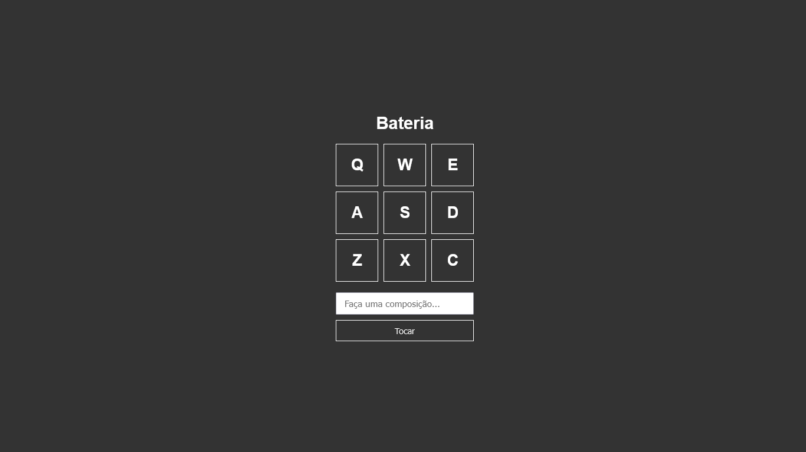

<h1 align=" center"> 
    Bateria JS 🥁
</h1>

<h1>
    
</h1>

<h2 align="center">
    <a href="https://matheusnlourenco.github.io/Projeto-js-bateriaMusical/">Ver projeto</a>
</h2>
<h2>🚨 Sobre </h2>

Projeto bateria musical. Feito com js vanilla

<h2>🔨 Ferramentas </h2>

- HTML
- CSS
- JAVASCRIPT
